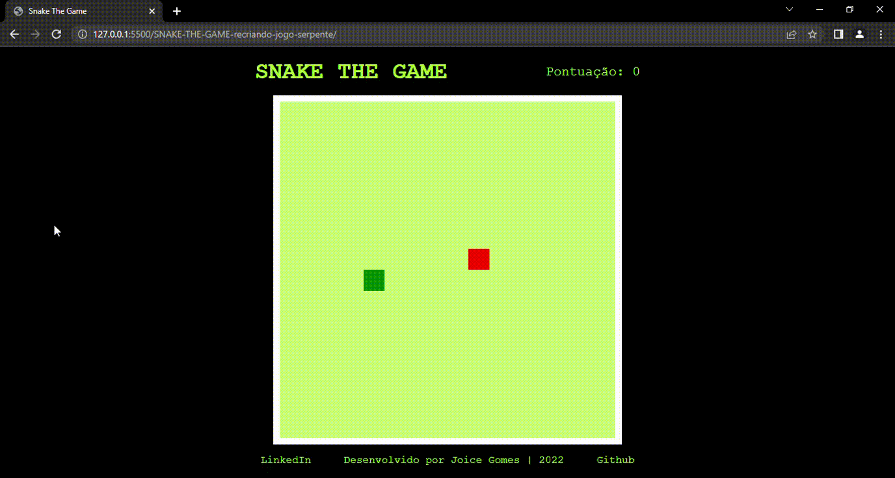

# SNAKE THE GAME | Desafio Recriando o jogo da cobrinha com JavaScript

Projeto desenvolvido para o desafio de recriar o jogo da cobrinha com JavaScript.

Snake The Game foi desenvolvido utilizando somente HTML, CSS e JavaScript e pode ser jogado a partir de um navegador.

O objetivo do jogo é coletar as comidas que aparecem na tela, controlando a movimentação da cobra com as setas do teclado e não deixar a cobra colidir com seu próprio corpo.
